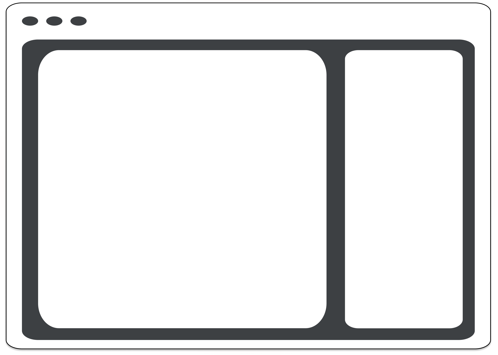
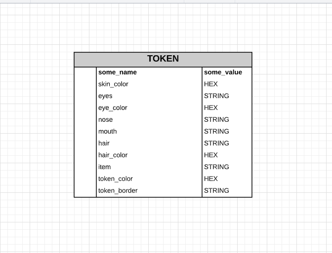
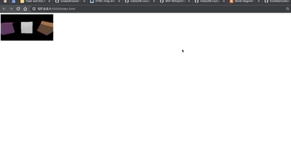

# Lo-Poli.ME (PITCH)

## Scope: 
- What are you planning to build? \n
  Lo-Poli.ME will be a profile picture/icon/token maker where the user can create a low-poly token. 
- What do you reasonably think you can implement in the time period?
  I think I can reasonably get done what I have set out to do, without too much concern. This includes the user being able to crate a token that they can download, the user being able to perform full CRUD on their tokens, and the user being able to share their tokens.

## User Stories: 
- Who is your user?
  My user is likley a teen, young adult, or adult interested in video games, tabletop gaming, and/or hobbies related to genre fiction. 
- What features will your app have?
  My app will feature the ability to create tokens, share those tokens, and download those tokens.
- Set up your project and user stories in Trello.
  I used Tape instead to track my project and progress. Here are some screenshots showing how I have it laid out. 

## Wireframes: 
- Sketch out what your core pages will look like and how they will work. 

## Data Models: 
- Draw out the models and any associations for your project in an entity relationship diagram (ERD).

## Milestones: 
- Divide your work into parts: 
- The most essential features for your MVP
  - [C/R/U/D] - Token
  - Ability to share Token
  - Ability to download Token
- Features that are important but not essential 
  - Gallery View, where you can see other people's tokens
- Features that can be saved for a later iteration
  - Users and the ability to register, log in, and log out
  - Ability to save and arrange tokens to a Tapestry, via collections/tabs, that is attached to the User
  - Full CRUD on Tokens and Tapestry
  - Addition of "Tinis", which is to say, low-poly character miniatures
- Create 3-5 major milestones with dates outlining when you expect essential features will be done.
  - Project Begins 09.13.2020 @ 9AM
  - Back-End Done 09.15.2020 @ 5PM
      * Token Model w/ CRUD
      * Routes
      * Controllers
  - Front-End Done 09.17.2020 @ 5PM
      * Token Model
      * Implement REST Routes['induce' - index, new, destroy, update, create, edit]
      * Components
  - Feature Freeze 09.18(-19).2020 @ 5PM(1:00PM if on -19)
  - Styling Done 09.20.2020 @ 7PM
  - Presentation 09.21.2020 @ 9:30AM

## Feasibility Study: 

If you're using an external API or scraping a website, make sure you can get that data. If you're using a new language, framework, or tool, go through its getting started tutorial. We will ask to see your results.

"Hello Cube!" project I made with Three.js, a pinch of HTML, and JavaScript.

